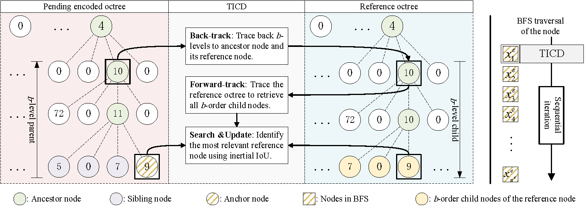
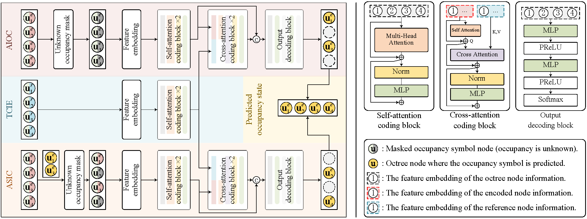

# Iterative Tree-structured Correlation Diffusion for Hierarchical Dynamic Point Cloud Compression

## Overview  

With the rapid advancement of 3D acquisition technology, the growing volume of dynamic point cloud data has created an increasing demand for efficient compression methods. Octree, known for its variable resolution capabilities, has been widely adopted in point cloud compression. However, in dynamic point cloud compression scenarios, establishing correlations between reference octree nodes and encoding octree nodes presents significant challenges. Furthermore, effectively leveraging the spatial and temporal information embedded in octree sequences also faces several difficulties.  

To address these issues, this project proposes a **tree-structured iterative correlation diffusion (TICD)** method to establish robust correlation links between the reference octree and the encoding octree. The approach involves a top-down search process to propagate node correlations progressively from coarse levels (the root node) to finer levels (non-leaf nodes). This enables more effective reference region identification and context utilization.  

Building on this, we design a **hierarchical predictive coding network (HSTC-Net)** that integrates both temporal and spatial information while employing a hierarchical encoding strategy. This allows for batch-parallel processing and accurate occupancy predictions, significantly enhancing coding efficiency. The experimental results demonstrate that the proposed approach outperforms existing methods in compression efficiency and reconstruction accuracy, providing an innovative solution for dynamic point cloud storage and transmission.  

### Pipeline Illustration  

*(Pipline of TICD)*  


*(Pipline of HSTC-Net)*  

## Installation & Usage  

### 1. Download Pre-trained Models  
Before running the code, download the two pre-trained models from the provided [link](https://drive.google.com/drive/folders/1r842U4CLxCK72DlvPDfTCpiH_XO6ptq8?usp=sharing) and place them in the `save/` directory.  

### 2. Setup Environment  
Ensure you have **Python 3.10** installed. Then, create a Conda environment and install the dependencies:  

```bash
conda env create -f environment.yaml
conda activate your_env_name
```

### 3. Build Required Binaries  
Compile the necessary binary files by running:  

```bash
python setup.py build
```

### 4. Set Execution Permissions  
Grant execution permission to `utils/pc_error_d` for distortion testing:  

```bash
chmod +x utils/pc_error_d
```

### 5. Run Evaluation  
Use the following command to perform encoding and decoding on the KITTI dataset:  

```bash
python eval.py {your_kitti_path}/data_odometry_velodyne/dataset/sequences --decode
```

This script will compress and decompress the **first 30 frames of all sequences** in the dataset. If you need to modify the number of frames or sequences processed, you can edit **line 67** in `eval.py`.  

Some results used in the paper are available in the `evaluation/kitti` directory for reference. However, note that these results were generated using an earlier model and may exhibit slight differences from the latest test results. 

## License  
This project is released under the **BSD 2-Clause License**. See the `LICENSE` file for details.  


